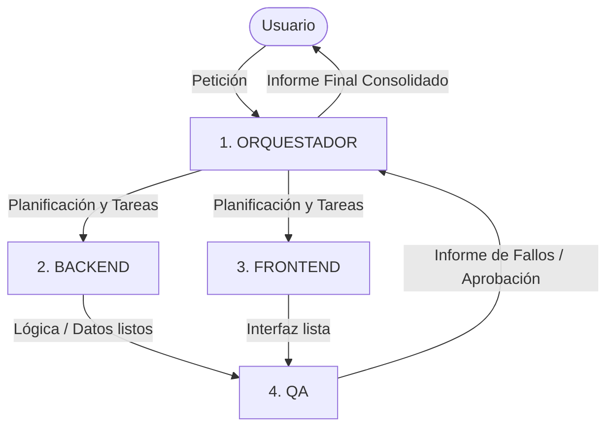

# Habilidad: Agentes Personalizados

Esta habilidad activa el sistema de trabajo multi-agente para proyectos de desarrollo web sin código y con código asistido. Permite operar bajo una disciplina estricta de división de responsabilidades coordinada por un **Orquestador Central**.

## Ubicación de las Definiciones de Agentes
Las instrucciones y especificaciones completas de cada rol residen en la carpeta local:
`agents/`
- [agents/orquestador.md](../../../agents/orquestador.md): Director y coordinador (no programa).
- [agents/frontend.md](../../../agents/frontend.md): Interfaz, diseño visual, CSS, responsive y temas (no toca datos).
- [agents/backend.md](../../../agents/backend.md): Estructura de datos, almacenamiento, lectura y validaciones (no toca diseño).
- [agents/qa.md](../../../agents/qa.md): Pruebas, detección de errores y reporte de calidad (no implementa).

---

## Flujo de Trabajo del Protocolo

Cuando se active esta habilidad o se reciba una petición del usuario:

### Paso 1: Fase de Orquestación
1. El **Orquestador** recibe la petición.
2. Desglosa el objetivo en tareas atómicas asignadas exclusivamente a Frontend o Backend.
3. Establece el orden de ejecución y dependencias.

### Paso 2: Ejecución Especializada
1. **Backend**: Crea las estructuras de datos, almacenamiento, consultas y validaciones necesarias, absteniéndose de intervenir en elementos estéticos o visuales.
2. **Frontend**: Crea la maquetación, diseño, componentes, estados y responsividad, absteniéndose de implementar persistencia o lógica interna de datos.

### Paso 3: Control de Calidad (QA)
1. **QA** recibe los entregables de Frontend y Backend.
2. Ejecuta un checklist exhaustivo (funcionalidad, casos límite, diseño visual, coherencia).
3. Emite un informe formal de hallazgos al Orquestador (con lista de fallos o confirmación de paso limpio).
4. Si hay fallos críticos, el Orquestador solicita la corrección al agente pertinente antes del cierre.

### Paso 4: Cierre y Resumen Ejecutivo
El Orquestador presenta al usuario el resumen del ciclo:
- Tareas completadas por el **Backend**.
- Tareas completadas por el **Frontend**.
- Resultados del análisis del **QA**.
- Estado final del proyecto y siguientes pasos recomendados.
